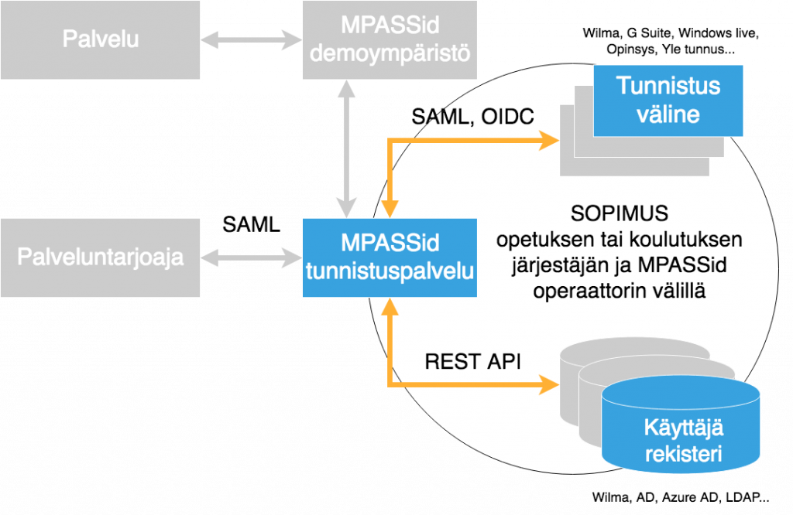

title: MPASSid Developer portal
---

## Getting started

This is where all MPASSId developer documentation is hosted. If you are not familiar with MPASSid authentication service, you should take a look at the architecture and overview. 

Normally developers want to connect new service or application to MPASSid proxy for authentication or add new userprofile source to MPASSid. Below you'll find tutorials for both
+ [Connect you application to MPASSId](app/index.html)
+ Connect new userprofile source from municipality (coming 2018)

## Overview

## Support

In case you need more support, you have two options
+ [Join our Slack and engage dialogue with out developers](support/slack.html)
+ Send us email at info@mpass.fi

